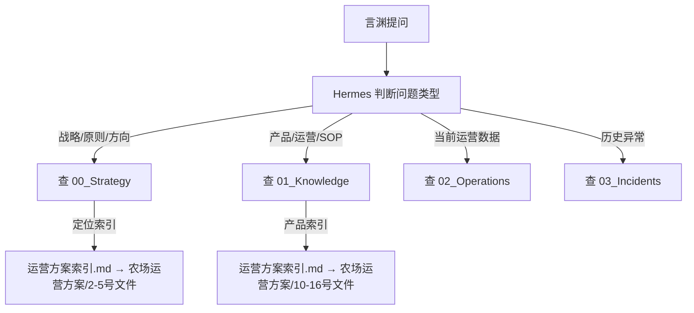

# 运营方案索引 — 记忆体系映射总表

> **用途**：将 `农场运营方案/` 的 40 个文件按性质映射到 AI 记忆体系的命名空间。
> **检索规则**：Hermes 在收到经营相关问题后，优先通过本索引定位到对应的运营方案文件，
> 再根据文件所在的记忆命名空间执行 recall / 引用。
> **创建日期**：2026-05-29
> **对应版本**：农场运营方案 V1.0

## 检索流程图

---

## 一、定位与根基 → 00_Strategy（永久战略）

| 运营方案文件 | 记忆命名空间 | 内容摘要 | 检索标签 |
|:---|:---|:---|:---|
| `0.农场经营宏观分析.md` | 00_Strategy | 经营哲学、行业误区、第一性原理推导、飞轮模型 | `strategy`, `vision`, `first_principle` |
| `1.农场基本情况.md` | 00_Strategy | 120亩用地、700㎡餐厅、千年油松、2400万初始投资 | `strategy`, `basic_info` |
| `2.农场定位.md` | 00_Strategy | "在城市与自然之间，搭建一座通往真实生活的桥梁" | `strategy`, `positioning` |
| `3.农场的使命与经营理念.md` | 00_Strategy | 三层同心圆：核心→引擎→卫星 | `strategy`, `mission`, `philosophy` |
| `4.农场经营核心价值观.md` | 00_Strategy | "正心正事，修己及人" | `strategy`, `values` |
| `5.农场经营的第一性原理.md` | 00_Strategy | 生态持续生产×客户深度参与→长期关系 | `strategy`, `first_principle` |
| `7.启动阶段与闸门设计.md` | 00_Strategy | R0→R1→R2→R3 四阶段+三道闸门 | `strategy`, `roadmap`, `phases` |
| `17.青松农场2年发展规划（团队启动版）.md` | 00_Strategy | 6阶段、3人到岗、300会员路径 | `strategy`, `roadmap`, `growth` |
| `19.利益共同体与财务透明机制（早期版）.md` | 00_Strategy | 低底薪+后端分成+月报透明 | `strategy`, `compensation`, `finance` |

### 检索规则
- 涉及"农场是做什么的"、"为什么这么做" → 查 `2.农场定位.md`
- 涉及"这个决策对不对" → 查 `5.第一性原理.md`
- 涉及"现在该做什么" → 查 `7.启动闸门.md` + `17.2年规划.md`
- 涉及"怎么招人、怎么分钱" → 查 `19.利益共同体.md`

---

## 二、组织架构 → 01_Knowledge（长期知识 / SOP）

| 运营方案文件 | 记忆命名空间 | 内容摘要 | 检索标签 |
|:---|:---|:---|:---|
| `6.组织架构设计方案V2.md` | 01_Knowledge | 星形结构（核心+引擎A/B+卫星） | `knowledge`, `org_structure` |
| `6.1附件1：名词解释.md` | 01_Knowledge | 利润中心/成本中心/费用中心定义 | `knowledge`, `org_structure`, `definitions` |
| `6.2附件2：加速飞轮环的设计与风险.md` | 01_Knowledge | 信任复利环+客户结构优化环+6大风险 | `knowledge`, `flywheel`, `growth` |
| `6.3附件3：基础设施费比例的计算方法.md` | 01_Knowledge | 引擎利润划拨核心的比例计算方法 | `knowledge`, `finance`, `cost_allocation` |
| `6.4附件4：岗位工作指导手册.md` | 01_Knowledge | 10个岗位的完整工作职责+协作节点 | `knowledge`, `sop`, `job_manual` |
| `18.社群与会员系统搭建方案.md` | 01_Knowledge | 三级会员+每天5分钟社群维护 | `knowledge`, `membership`, `community` |
| `8.各单元新媒体内容产出标准.md` | 01_Knowledge | 各板块内容分工+矩阵+发布流程 | `knowledge`, `content`, `social_media` |
| `8.1流量漏斗模型与新媒体策略.md` | 01_Knowledge | 曝光→点击→到店→复购→会员 五层漏斗+反推 | `knowledge`, `funnel`, `marketing` |
| `20.会员裂变机制（5年2000会员）.md` | 01_Knowledge | 推荐奖励+获客渠道配比+5年目标 | `knowledge`, `membership`, `referral` |
| `青松农场劳动换薪机制（V2）.md` | 01_Knowledge | 贯穿机制、项目清单、合规备忘录 | `knowledge`, `labor_exchange`, `trust` |
| `青松农场总价目表（未测算）.csv` | 01_Knowledge | 55个产品/规格的定价汇总 | `knowledge`, `pricing` |

### 检索规则
- 涉及"这个事谁负责" → 查 `6.4岗位手册.md`
- 涉及"这个运营问题怎么处理" → 查对应板块的 SOP
- 涉及"怎么发内容" → 查 `8.新媒体产出标准.md`
- 涉及"多少钱" → 查 `青松农场总价目表.csv`

---

## 三、产品分析 → 01_Knowledge（长期知识）

| 运营方案文件 | 记忆命名空间 | 内容摘要 | 检索标签 |
|:---|:---|:---|:---|
| `10.引擎A-餐饮产品设计方案.md` | 01_Knowledge | 柴火灶/火锅/烧烤/窑炉/野餐篮/室内餐/大席 | `knowledge`, `product`, `engine_A` |
| `10.1室外散客餐饮矩阵.md` | 01_Knowledge | 室外散客餐饮各产品详细分析 | `knowledge`, `product`, `engine_A` |
| `10.2窑炉产品矩阵.md` | 01_Knowledge | 窑炉时段化运营+产品定价 | `knowledge`, `product`, `engine_A` |
| `10.3农村大席.md` | 01_Knowledge | 团餐三档+一次性上菜模式 | `knowledge`, `product`, `engine_A` |
| `10.4松林野餐篮.md` | 01_Knowledge | 冷餐编篮+零服务成本 | `knowledge`, `product`, `engine_A` |
| `11.引擎B-露营住宿产品设计方案.md` | 01_Knowledge | 散客/长搭/团建/小院共创 | `knowledge`, `product`, `engine_B` |
| `11.1引擎B露营住宿矩阵.md` | 01_Knowledge | 4个产品详细分析+体验增强 | `knowledge`, `product`, `engine_B` |
| `11.2四季庆典与自然运动会.md` | 01_Knowledge | 季度大型活动设计 | `knowledge`, `product`, `engine_B` |
| `12.核心层分析-生态种养板块.md` | 01_Knowledge | 种养规划/展示/劳动换薪/考核标准 | `knowledge`, `product`, `core` |
| `13.产品分析-自然教育.md` | 01_Knowledge | 引流课68元/深度课198元/节气年卡 | `knowledge`, `product`, `satellite` |
| `14.产品分析-手作体验.md` | 01_Knowledge | 日化洗护/松香品/饰品三系列 | `knowledge`, `product`, `satellite` |
| `14.1手作卫星产品扩展建议.md` | 01_Knowledge | 扩展方向建议 | `knowledge`, `product`, `satellite` |
| `14.2自然探索营与生日会.md` | 01_Knowledge | 独立营/生日会产品设计 | `knowledge`, `product`, `satellite` |
| `14.3成人自然疗愈.md` | 01_Knowledge | 正念行走/颂钵/瑜伽（合作模式） | `knowledge`, `product`, `satellite` |
| `15.产品分析-田园摄影.md` | 01_Knowledge | 跟拍/场景快拍+凡朴农场案例 | `knowledge`, `product`, `photography` |
| `16.卫星分析-运营卫星.md` | 01_Knowledge | 6大职能+工作节奏+考核 | `knowledge`, `product`, `satellite` |

### 检索规则
- 涉及某个产品的详情 → 直接查对应的产品分析文件
- 涉及跨产品的协作 → 查 `6.组织架构.md` 中的协作规则
- 涉及"这个产品多少钱" → 查 `青松农场总价目表.csv`

---

## 四、财务分析 → 01_Knowledge + 02_Operations

| 运营方案文件 | 记忆命名空间 | 内容摘要 | 检索标签 |
|:---|:---|:---|:---|
| `9.财务分析框架（最终版）.md` | 01_Knowledge | 成本结构+盈亏平衡点（月750人）+收入结构 | `knowledge`, `finance`, `breakeven` |
| `9.1财务分析所需数据清单.md` | 02_Operations | 待填的历史数据表（人工/成本/客流） | `operations`, `finance`, `data` |

### 检索规则
- 涉及"多久回本"、"月需多少客流" → 查 `9.财务分析框架.md`
- 涉及"真实财务数据" → 查对应月份的 02_Operations 记录

---

## 五、青松农场经营系统 — 重构后目录结构

> `青松农场经营系统/` 已按三层同心圆结构重构，取代旧6阿米巴体系。
> 以下为新结构（13个顶层目录）。

| 目录 | 内容 | 与 AI_记忆体系 对应 |
|:---|:---|:---|
| `00-总纲/` | 定位、使命、核心价值观、第一性原理、核心逻辑、发展路线图 | 00_Strategy |
| `01-经营结构/` | 三层同心圆图、名词解释、飞轮环、业务矩阵（引流/盈利/沉淀/品牌/未来/优先级） | 00_Strategy |
| `02-用户系统/` | 会员体系与裂变、客单价与消费结构、社群运营方案 | 01_Knowledge |
| `03-空间系统/` | 空间规划、动线设计 | 01_Knowledge |
| `04-现金流与财务/` | 财务分析框架、成本结构、盈亏平衡模型、价格表.csv | 01_Knowledge |
| `05-核心业务/` | 核心层-生态种养 / 引擎A-餐饮 / 引擎B-露营住宿 / 卫星-自然手作 / 卫星-田园摄影 / 卫星-运营 | 01_Knowledge |
| `06-内容传播系统/` | 流量漏斗模型、新媒体内容产出标准 | 01_Knowledge |
| `07-增长与运营/` | 劳动换薪机制、会员裂变机制 | 01_Knowledge |
| `08-组织与人力/` | 组织架构、岗位工作指导手册、利益共同体机制 | 01_Knowledge |
| `09-阶段与规划/` | 启动阶段与闸门设计、两年发展规划 | 00_Strategy |
| `10-SOP标准化/` | 安全/卫生/接待/餐饮/活动执行/菜园维护/团建SOP + 应急预案/雨天预案 | 01_Knowledge |
| `11-经营日志/` | 每日经营记录（YYYY-MM-DD.md） | 02_Operations |
| `12-复盘与迭代/` | 月复盘模板、问题库 | 03_Incidents |

### 与 农场运营方案/ 的对应关系

`青松农场经营系统` 是 `农场运营方案` 的**结构化映射**。后者是完整原始文件区，前者是按三层同心圆重构后的查阅版。

格式规范：
- 顶层目录用双数字前缀（00-、01-…）
- 子目录不用编号
- 文件用中文名
- 首行用 # 标题 作为文档名
