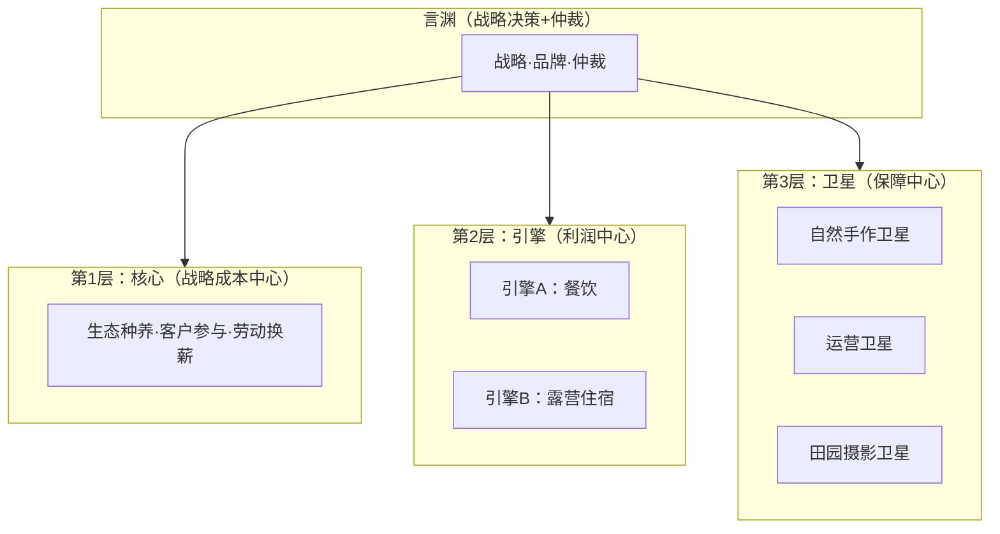

# 青松农场运营方案总览

> **创建日期**：2026-05-29
> **用途**：方案的总索引，通过双链连接所有文件。新加入的团队成员从本文开始阅读。
> **版本**：V1.0（骨架定稿，细节待执行手册补充）

---

## 一、定位与根基

农场的所有决策从这几份文件中来：

- [[2.农场定位.md]]——农场是做什么的（内部决策标尺）
- [[3.农场的使命与经营理念.md]]——三层同心圆的协同逻辑
- [[4.农场经营核心价值观.md]]——正心正事，修己及人
- [[5.农场经营的第一性原理.md]]——一切判断的底层逻辑
- [[0.农场经营宏观分析.md]]——经营哲学与战略根基
- [[1.农场基本情况.md]]——农场基本信息

---

## 二、组织架构



- [[6.组织架构设计方案V2.md]]——星形结构完整设计
- [[6.1组织架构设计方案--附件1：名词解释.md]]——成本中心/利润中心/保障中心定义
- [[6.2组织架构设计方案--附件2：加速飞轮环的设计与风险.md]]——两个回馈环
- [[6.3组织架构设计方案--附件3：基础设施费比例的计算方法.md]]
- [[6.4组织架构设计方案--附件4：岗位工作指导手册.md]]——10个岗位的完整职责
- [[农场产品与服务缺口分析.md]]——5个缺口及归属

---

## 三、引擎A·餐饮

### 产品矩阵

| 产品 | 主定位 | 定价区间 | 分析文件 |
|:---|:---|:---|:---|
| 柴火灶炒菜 | 传播杠杆+利润中心 | 80-120元/灶 | [[10.1产品分析-室外散客餐饮矩阵.md]] |
| 火锅 | 利润中心 | 68-88元/位 | 同上 |
| 烧烤（三档食材包） | 利润中心 | 128-268元/包 | 同上 |
| 窑炉面包/披萨 | 利润中心+传播杠杆 | 18-68元/个 | [[10.2产品分析-窑炉产品矩阵.md]] |
| 披萨DIY体验 | 利润中心+信任引擎 | 88元/组 | 同上 |
| 农村大席（三档） | 利润中心 | 60-120元/位 | [[10.3产品分析-农村大席.md]] |
| 松林野餐篮（三款） | 传播杠杆 | 68-158元/篮 | [[10.4产品分析-松林野餐篮.md]] |

### 协作关系

引擎A与[[12.核心层分析-生态种养板块.md]]对接食材供应，与[[11.1产品分析-引擎B露营住宿矩阵.md]]对接露营客户餐饮需求。

---

## 四、引擎B·露营住宿

| 产品 | 主定位 | 定价 | 分析文件 |
|:---|:---|:---|:---|
| 散客露营（模式A 9.9元） | 引流入口 | 9.9元/人 | [[11.1产品分析-引擎B露营住宿矩阵.md]] |
| 散客露营（模式B拎包入住） | 利润中心 | 待定 | 同上 |
| 长搭露营（年费小院） | 复购锚点 | 3600元/年 | 同上 |
| 团建/宴会（B端） | 利润中心 | 定制报价 | 同上 |
| 小院共创 | 复购锚点（长期储备） | 待定 | 同上 |
| 自然运动会 | 引流入口 | 68-98元/组 | [[11.2产品分析-四季庆典与自然运动会.md]] |
| 四季庆典（春耕/夏夜/丰收/冬至） | 引流入口+传播杠杆 | 19.9-29.9元/人 | 同上 |

---

## 五、核心·生态种养

[[12.核心层分析-生态种养板块.md]]

核心不是产品，是战略成本中心。不考核利润，考核土壤健康度、展示丰富度、客户触达率。当前尚未启动，无主理人，是下一步最大的缺口。

---

## 六、自然手作卫星

### 产品线

| 产品线 | 核心产品 | 分析文件 |
|:---|:---|:---|
| 自然教育 | 引流课68元 / 深度课198元 / 节气年卡1280-1680元 | [[13.产品分析-自然教育.md]] |
| 手作体验 | 驱蚊膏/手工皂/洗发液/松塔香/纯露/合香珠等（体验+零售） | [[14.产品分析-手作体验.md]] |
| 自然探索营 | 7-14岁独立营，半日198-298元 / 全日398-598元 | [[14.2产品分析-自然探索营与生日会.md]] |
| 自然生日会 | 亲子派对，三档980-1680元/场 | 同上 |
| 成人自然疗愈 | 正念行走/颂钵/瑜伽，68-168元/人（合作模式） | [[14.3产品分析-成人自然疗愈.md]] |
| 扩展方向 | 自然运动会迁移至引擎B，四季庆典迁移至引擎B | [[14.1自然手作卫星-产品扩展建议.md]] |

---

## 七、田园摄影卫星

[[15.产品分析-田园摄影.md]]

项目制，不自雇摄影师。合作模式（摄影师50%/农场50%）。目标客群亲子+中老年。凡朴农场模式启发——中老年客群工作日为主要客流，可填补农场平日空白。

---

## 八、运营卫星

[[16.卫星分析-运营卫星.md]]

六大职能：公共环境管理（P0）→ 安全与应急（P0）→ 品牌内容（P0）→ CRM（P1）→ 线上零售（P1）→ 行政协调（兜底）。

---

## 九、财务

- [[9.财务分析框架V2.md]]——区间敏感性分析+客流驱动模型
- [[青松农场总价目表（未测算）.csv]]——全部55个产品/规格的定价汇总
- [[19.利益共同体与财务透明机制（早期版）.md]]——低底薪+后端分成+月报透明

---

## 十、启动与阶段

- [[7.启动阶段与闸门设计.md]]——R0-R3四阶段+三道闸门
- [[17.青松农场2年发展规划（团队启动版）.md]]——6阶段，3人到岗时间表，300会员路径
- [[18.社群与会员系统搭建方案.md]]——三级会员+每天5分钟社群维护节奏

---

## 十一、运营机制

- [[8.附件：青松农场劳动换薪机制（V2）]]——贯穿所有业务单元的信任建设+获客机制
- [[8.各单元新媒体内容产出标准.md]]——各板块每周≥1条手机拍摄
- [[产品分析框架V4]]——10维度+1步验证，所有产品分析的标准
- [[青松农场 AI 经营系统 — 完整介绍.md]]——Hermes AI运营系统接口

---

## 十二、阅读顺序建议

### 如果你是言渊（农场主）
```
定位根基（2-5） → 组织架构（6） → 财务框架（9） → 2年规划（17） → 
利益共同体（19） → 启动闸门（7） → 按板块读产品分析
```

### 如果你是运营卫星负责人（第1位到岗）
```
岗位手册（6.4）→ 运营卫星（16） → 社群会员（18） → 新媒体标准（8） → 
总价目表（CSV） → 劳动换薪（V2） → 财务透明（19）
```

### 如果你是自然手作主理人（第2位到岗）
```
岗位手册（6.4）→ 自然教育（13） → 手作体验（14） → 
探索营与生日会（14.2） → 成人疗愈（14.3） → 产品框架V4
```

